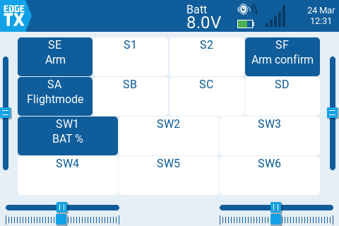

# EdgeTX Widgets and Scripts

A collection of Lua widgets for EdgeTX-based radios.

---

## Widgets

### SwitchInfo



A widget that lets you annotate each physical switch on your radio with a custom label, so you always know what role each switch plays in your current model.

**Supported radios:** RadioMaster TX15 series, TX16 series.

#### Features

- Displays all switches in a grid layout, grouped by rows matching the radio's physical layout.
- Each switch box shows the switch name and your custom label.
- Empty switches are visually distinct from labelled ones (inverted colours).
- Labels are saved per model — switching models loads the correct set of labels automatically.
- **Fullscreen / edit mode:** tap any switch box to enter a label directly on the radio.

#### Switch layout

| Radio | Rows                                                                    |
|-------|-------------------------------------------------------------------------|
| TX15  | SE S1 S2 SF / SA SB SC SD / SW1 SW2 SW3 / SW4 SW5 SW6                  |
| TX16  | SE SF SH SG / SA SB SC SD / LS S1 S2 RS / SW1 SW2 SW3 / SW4 SW5 SW6   |

#### Installation

1. Copy the `Widgets/SwitchInfo/` folder to the `WIDGETS/` directory on your radio's SD card.
2. On the radio, add the **Switch Info** widget to a fullscreen zone.

3. Open the widget in fullscreen to enter your switch labels.

#### Usage
1. long touch on widget to enter edit mode
2. tap any switch box to edit its label
3. use the keyboard to enter a label (max 10 characters)
4. press the back button to save the label and return to the main view

#### Data storage

Labels are saved automatically to `/MODELS/<modelname>.switches` on the SD card whenever a label is edited.

---

## Mix Scripts

### ccalc

A mix script that reads LiPo pack voltage from a cells sensor and outputs a state-of-charge percentage (`CelP`) using a discharge lookup table.

**Requires:** Radiomaster ERS-CV01 (or similar) configured as `Cels`.

#### Features

- Converts per-cell average voltage to a percentage via a 101-point discharge curve (Robbe table, origin 3.0 V).
- Works with both table output (FLVSS multi-cell) and single numeric output (auto-detects cell count).
- Tracks per-cell min/max voltages and pack-level min/max percentage across the flight.
- Publishes `CelP` as a custom telemetry value, available for use in other scripts, widgets, and audio triggers.
- Resets automatically when no sensor data is received (e.g. battery disconnected).

#### Output

| Output | Range   | Description                        |
|--------|---------|------------------------------------|
| `CelP` | 0–100   | Pack state of charge (%)           |

The mix output is scaled to the EdgeTX internal range (0–1024), mapping directly to 0–100%.

#### Installation

1. Copy `SCRIPTS/MIXES/ccalc.lua` to the `SCRIPTS/MIXES/` directory on your radio's SD card.
2. In EdgeTX, go to **Model → Mix** and add a new mix on the `CelP` channel with source set to **Lua → ccalc**.
3. Ensure your FLVSS sensor is bound and named `Cels` in the telemetry screen.

#### Usage
1. Power on your model and confirm that the `Cels` sensor is showing the correct voltage.
2. Go to telemetry sensors discovery to discover `CelP` that will contain the percentage remaining in the battery.

---

### bcalc

A mix script that reads a total LiPo pack voltage from any named sensor and outputs a state-of-charge percentage using a discharge lookup table. Unlike `ccalc`, it works with any voltage sensor.

**Requires:** Any telemetry sensor reporting total pack voltage (default: `RxBt`).

#### Features

- Converts total pack voltage to a per-cell average, then maps it to a percentage via a 101-point discharge curve (Robbe table, origin 3.0 V).
- Auto-detects cell count from the measured voltage.
- Sensor name and output name are configurable at the top of the file.
- Publishes the result as a custom telemetry value, available for use in other scripts, widgets, and audio triggers.

#### Output

| Output | Range  | Description               |
|--------|--------|---------------------------|
| `BatP` | 0–100  | Pack state of charge (%)  |

The mix output is scaled to the EdgeTX internal range (0–1024), mapping directly to 0–100%.

#### Configuration

Edit the two lines at the top of `bcalc.lua` to match your setup (if needed):

```lua
local myBatSensorName = "RxBt"   -- name of your total pack voltage sensor
local myBatPercentName = "BatP"  -- name of the telemetry value to create
```

#### Installation

1. Copy `SCRIPTS/MIXES/bcalc.lua` to the `SCRIPTS/MIXES/` directory on your radio's SD card.
2. In EdgeTX, go to **Model → Mix** and add a new mix on the `BatP` channel with source set to **Lua → bcalc**.
3. Ensure your voltage sensor is bound and visible in the telemetry screen.

#### Usage
1. Power on your model and confirm that the `Cels` sensor is showing the correct voltage.
2. Go to telemetry sensors discovery to discover `CelP` that will contain the percentage remaining in the battery.

---

## Special Function Scripts

### Gimbal follow

A Special Function script that drives the RGB LED ring lights on the radio to reflect gimbal stick positions in real time.

**Supported radios:** TX15, TX16S MK3.

#### Features

- Maps each gimbal stick position to an angle on its corresponding LED ring.
- Lights up LEDs with a Gaussian spread (±2 LEDs) around the stick direction.
- Brightness scales with stick magnitude and speed of movement for responsive visual feedback.
- Skips LED updates when sticks are stationary (dead zone of 3 units) to reduce noise.
- Supports stick modes 1 and 2.

#### Installation

1. Copy `SCRIPTS/RGBLED/gimbal.lua` to the `SCRIPTS/RGBLED/` directory on your radio's SD card.
2. In EdgeTX, go to **Model → Special Functions** and add a new function with:
   - **Trigger:** your preferred activation switch (or `ON` to always run)
   - **Function:** `Lua`
   - **Value:** select `gimbal`
   - **Repeat:** `ON`
   - **Enable:** `ON`

#### Usage

Activate the assigned Special Function switch. The LED rings will reflect the position of each gimbal stick.
