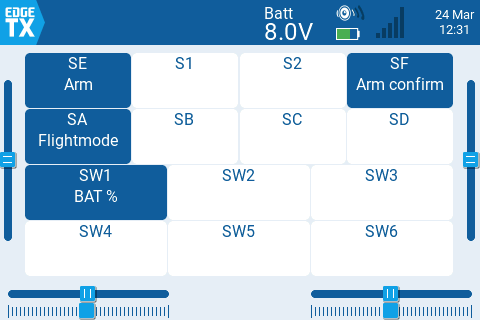
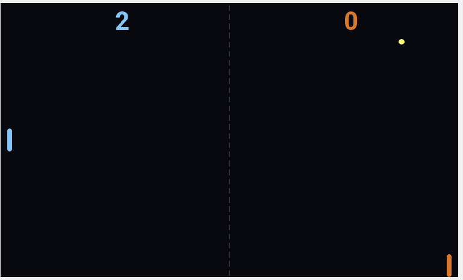
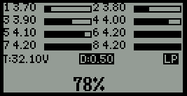

# EdgeTX Widgets and Scripts

A collection of Lua widgets for EdgeTX-based radios.

---

## Widgets

### SwitchInfo



A widget that lets you annotate each physical switch on your radio with a custom label, so you always know what role each switch plays in your current model.

**Supported radios:** RadioMaster TX15 series, TX16 series, GX15.

#### Features

- Displays all switches in a grid layout, grouped by rows matching the radio's physical layout.
- Each switch box shows the switch name and your custom label.
- Empty switches are visually distinct from labelled ones (inverted colours).
- Labels are saved per model — switching models loads the correct set of labels automatically.
- **Fullscreen / edit mode:** tap any switch box to enter a label directly on the radio.

#### Switch layout

| Radio | Rows                                                                    |
|-------|-------------------------------------------------------------------------|
| TX15  | SE S1 S2 SF / SA SB SC SD / SW1 SW2 SW3 / SW4 SW5 SW6                  |
| TX16  | SE SF SH SG / SA SB SC SD / LS S1 S2 RS / SW1 SW2 SW3 / SW4 SW5 SW6   |
| GX15  | LS S1 S2 RS / SA SB SC SD / SE SF SG / SH SI SJ / SW1 SW2 SW3 / SW4 SW5 SW6 |

#### Installation

1. Copy the `Widgets/SwitchInfo/` folder to the `WIDGETS/` directory on your radio's SD card.
2. On the radio, add the **Switch Info** widget to a fullscreen zone.

3. Open the widget in fullscreen to enter your switch labels.

#### Usage
1. long touch on widget to enter edit mode
2. tap any switch box to edit its label
3. use the keyboard to enter a label (max 10 characters)
4. press the back button to save the label and return to the main view

#### Data storage

Labels are saved automatically to `/MODELS/<modelname>.switches` on the SD card whenever a label is edited.

---

## Games

### Pong



A two-player Pong game for EdgeTX colour LCD radios, using the LVGL rendering API.

**Supported radios:** Any EdgeTX radio with a colour LCD and EdgeTtx 2.11 or later

#### Features

- Two-player local game — each player controls their paddle with a gimbal stick.
- Ball accelerates slightly on each paddle hit, capped at a maximum speed.
- Paddle angle influences the ball's deflection angle.
- First to 7 points wins.
- Title screen, pause, scored, and game-over states with on-screen overlays.
- Automatically adapts to stick mode (modes 1–4).

#### Controls

| Action              | Input                        |
|---------------------|------------------------------|
| Player 1 paddle     | Left gimbal vertical axis    |
| Player 2 paddle     | Right gimbal vertical axis   |
| Start / Pause / Resume | ENTER                     |
| Quit                | EXIT                         |

#### Installation
1. Copy `GAMES/pong.lua` to the `GAMES` directory on your radio's SD card.
2. Access it from the radio's SD navigator.

or

1. Copy `GAMES/pong.lua` to the `SCRIPTS/TOOLS/` directory on your radio's SD card.
2. Access it from the radio's **Tools** menu.

---

## Mix Scripts

### ccalc

A mix script that reads LiPo pack voltage from a cells sensor and outputs a state-of-charge percentage (`CelP`) using a discharge lookup table.

**Requires:** Radiomaster ERS-CV01 (or similar) configured as `Cels`.

#### Features

- Converts per-cell average voltage to a percentage via a 101-point discharge curve (Robbe table, origin 3.0 V).
- Works with both table output (FLVSS multi-cell) and single numeric output (auto-detects cell count).
- Tracks per-cell min/max voltages and pack-level min/max percentage across the flight.
- Publishes `CelP` as a custom telemetry value, available for use in other scripts, widgets, and audio triggers.
- Resets automatically when no sensor data is received (e.g. battery disconnected).

#### Output

| Output | Range   | Description                        |
|--------|---------|------------------------------------|
| `CelP` | 0–100   | Pack state of charge (%)           |

The mix output is scaled to the EdgeTX internal range (0–1024), mapping directly to 0–100%.

#### Installation

1. Copy `SCRIPTS/MIXES/ccalc.lua` to the `SCRIPTS/MIXES/` directory on your radio's SD card.
2. In EdgeTX, go to **Model → Mix** and add a new mix on the `CelP` channel with source set to **Lua → ccalc**.
3. Ensure your FLVSS sensor is bound and named `Cels` in the telemetry screen.

#### Usage
1. Power on your model and confirm that the `Cels` sensor is showing the correct voltage.
2. Go to telemetry sensors discovery to discover `CelP` that will contain the percentage remaining in the battery.

---

### bcalc

A mix script that reads a total LiPo pack voltage from any named sensor and outputs a state-of-charge percentage using a discharge lookup table. Unlike `ccalc`, it works with any voltage sensor.

**Requires:** Any telemetry sensor reporting total pack voltage (default: `RxBt`).

#### Features

- Converts total pack voltage to a per-cell average, then maps it to a percentage via a 101-point discharge curve (Robbe table, origin 3.0 V).
- Auto-detects cell count from the measured voltage.
- Sensor name and output name are configurable at the top of the file.
- Publishes the result as a custom telemetry value, available for use in other scripts, widgets, and audio triggers.

#### Output

| Output | Range  | Description               |
|--------|--------|---------------------------|
| `BatP` | 0–100  | Pack state of charge (%)  |

The mix output is scaled to the EdgeTX internal range (0–1024), mapping directly to 0–100%.

#### Configuration

Edit the two lines at the top of `bcalc.lua` to match your setup (if needed):

```lua
local myBatSensorName = "RxBt"   -- name of your total pack voltage sensor
local myBatPercentName = "BatP"  -- name of the telemetry value to create
```

#### Installation

1. Copy `SCRIPTS/MIXES/bcalc.lua` to the `SCRIPTS/MIXES/` directory on your radio's SD card.
2. In EdgeTX, go to **Model → Mix** and add a new mix on the `BatP` channel with source set to **Lua → bcalc**.
3. Ensure your voltage sensor is bound and visible in the telemetry screen.

#### Usage
1. Power on your model and confirm that the `Cels` sensor is showing the correct voltage.
2. Go to telemetry sensors discovery to discover `CelP` that will contain the percentage remaining in the battery.

---

## Telemetry Scripts

### cells



A telemetry screen script for black-and-white 128×64 displays that shows individual LiPo cell voltages, per-cell percentage bars, total voltage, cell delta, and overall pack state-of-charge.

**Supported radios:** Any EdgeTX radio with a BW 128×64 display.

**Requires:** Radiomaster ERS-CV01 (or similar) configured as `Cels`.

#### Features

- Displays up to 8 cells in a 2-column grid, each showing cell index, voltage, and a percentage bar.
- Summary row shows total pack voltage (`T:`) and cell delta (`D:`), with the delta displayed inverted as a warning when it exceeds 0.1 V.
- Overall state-of-charge percentage shown large and centred at the bottom.
- Chemistry indicator (`LP` / `HV`) shown in the summary row.
- **[ENTER]** toggles between LiPo (4.20 V max) and LiPo-HV (4.35 V max) discharge curves.
- Publishes `%bat` as a virtual telemetry sensor.

#### Installation

1. Copy `SCRIPTS/TELEMETRY/cells.lua` to the `SCRIPTS/TELEMETRY/` directory on your radio's SD card.
2. On the radio, open the telemetry screen list and select **cells** as a telemetry page.

#### Usage

1. Navigate to the telemetry screen on your radio.
2. Press **[ENTER]** to toggle between LiPo and LiPo-HV chemistry if needed.
3. Press **[EXIT]** to leave the telemetry page.

---

## Tool Scripts

### Graupner HoTT

A Tools-menu script that opens the **Graupner HoTT receiver text menu** directly on the radio, letting you configure the RX and any attached HoTT sensors (Vario, GPS, ESC, GAM, EAM, …) without a separate Smart Box. The original script has been fixed by 3djc to work with recent radios and EdgeTX versions, and the display now scales to fill both colour (480×272, 480×320, 800×480, …) and monochrome (128×64, 212×64) screens.

**Supported radios:** Any EdgeTX radio running the Multi protocol with a Graupner HoTT receiver bound.

**Requires:** HoTT telemetry available (Multi module in HoTT mode).

#### Features

- Renders the RX's native 21×8 character menu grid, including the cursor highlight.
- Navigate the receiver menu with the radio's keys (see Controls below).
- **MENU** cycles through the detected sensors (RX, Vario, GPS, Cust, ESC, GAM, EAM) — only sensors that are actually present are offered.
- Adapts automatically to colour and monochrome displays.
- Shows a "No HoTT telemetry…" notice when no data is received.

#### Controls

| Action                 | Input            |
|------------------------|------------------|
| Enter / select         | ENTER            |
| Next / previous item   | NEXT / PREV      |
| Next / previous page   | PAGE+ / PAGE−    |
| Cycle through sensors  | MENU             |
| Exit                   | EXIT             |

#### Installation

1. Copy `SCRIPTS/TOOLS/Graupner HoTT.lua` to the `SCRIPTS/TOOLS/` directory on your radio's SD card.
2. On the radio, open the **Tools** menu and run **Graupner HoTT**.

#### Usage

1. Bind your HoTT receiver and confirm HoTT telemetry is being received.
2. Run the script from the **Tools** menu; the receiver menu appears on screen.
3. Use the keys above to navigate and edit the RX/sensor settings, then press **EXIT** to leave (the script releases the buffer so normal telemetry resumes).

---

### Graupner HoTT Model Locator

A Tools-menu script that helps you find a lost or crashed model using its HoTT **RSSI**. It produces a variometer-style audio cue (the beeps get faster and higher-pitched as the signal grows stronger) together with a colourised on-screen bar. Based on the Model Locator by Offer Shmuely / Scott Bauer, adapted for Graupner HoTT (RSSI scaled −115 dB…−15 dB → 0…100%) and updated by 3djc to scale across colour resolutions.

**Supported radios:** Any EdgeTX radio with a colour LCD.

**Requires:** HoTT telemetry with an `Rssi` sensor.

#### Features

- Audio feedback whose pitch/frequency tracks the RSSI strength.
- Large numeric RSSI readout (dB) plus a colourised bar graph (green = strong, red = weak).
- Layout scales from the original 480×272 design to any colour resolution.
- Shows "no telemetry" when the link is lost.

#### How to use it

- **Simple way:** walk toward the crash site — the beeps speed up and rise in pitch as you get closer, until you can spot the model.
- **Accurate (triangulation) way:** point the antenna straight away from you and find the *weakest* signal (lowest RSSI) — that bearing points at the model. Move to the side, find the weakest signal again, and triangulate the two bearings.

#### Installation

1. Copy `SCRIPTS/TOOLS/Graupner HoTT Model Locator.lua` to the `SCRIPTS/TOOLS/` directory on your radio's SD card.
2. Place `Model Locator (by RSSI).png` and `Model Locator (by RSSI).wav` (from the original Model Locator distribution) in the same `SCRIPTS/TOOLS/` directory — the script loads them at runtime for the image and audio cue.
3. On the radio, open the **Tools** menu and run **Graupner HoTT model locator**.

#### Usage

1. After a crash or fly-away, run the script from the **Tools** menu.
2. Follow the audio and bar feedback toward the model, or use the triangulation method above for a more precise bearing.

---

## Special Function Scripts

### Gimbal follow

A Special Function script that drives the RGB LED ring lights on the radio to reflect gimbal stick positions in real time.

**Supported radios:** TX15, TX16S MK3.

#### Features

- Maps each gimbal stick position to an angle on its corresponding LED ring.
- Lights up LEDs with a Gaussian spread (±2 LEDs) around the stick direction.
- Brightness scales with stick magnitude and speed of movement for responsive visual feedback.
- Skips LED updates when sticks are stationary (dead zone of 3 units) to reduce noise.
- Supports stick modes 1 and 2.

#### Installation

1. Copy `SCRIPTS/RGBLED/gimbal.lua` to the `SCRIPTS/RGBLED/` directory on your radio's SD card.
2. In EdgeTX, go to **Model → Special Functions** and add a new function with:
   - **Trigger:** your preferred activation switch (or `ON` to always run)
   - **Function:** `RGB leds`
   - **Value:** select `gimbal`
   - **Repeat:** `ON`
   - **Enable:** `ON`

#### Usage

Activate the assigned Special Function switch. The LED rings will reflect the position of each gimbal stick.

---

### Gimbal Battery level

A Special Function script that colours the RGB LED rings based on battery percentage, with a smooth green-to-red gradient.

**Supported radios:** TX15, TX16S MK3.

#### Features

- All 20 LEDs reflect battery state of charge at a glance.
- Smooth colour gradient between the configurable thresholds:
  - **≥ 90 %** — pure green.
  - **90 % → 30 %** — gradual transition from green through yellow/orange to red.
  - **≤ 30 %** — solid red.
  - **< 20 %** — blinking red.
- Sensor name and thresholds are configurable at the top of the file.

#### Configuration

Edit the constants at the top of `batt.lua` to match your setup:

```lua
local SENSOR_NAME      = "%bat"  -- telemetry percent sensor name
local GREEN_THRESHOLD  = 90      -- >= this → pure green
local RED_THRESHOLD    = 30      -- <= this → pure red
local BLINK_THRESHOLD  = 20      -- < this → blinking red
```

#### Installation

1. Copy `SCRIPTS/RGBLED/batt.lua` to the `SCRIPTS/RGBLED/` directory on your radio's SD card.
2. In EdgeTX, go to **Model → Special Functions** and add a new function with:
   - **Trigger:** your preferred activation switch (or `ON` to always run)
   - **Function:** `RGB leds`
   - **Value:** select `batt`
   - **Repeat:** `ON`
   - **Enable:** `ON`

#### Usage

Activate the assigned Special Function switch. The LED rings will reflect battery level.
